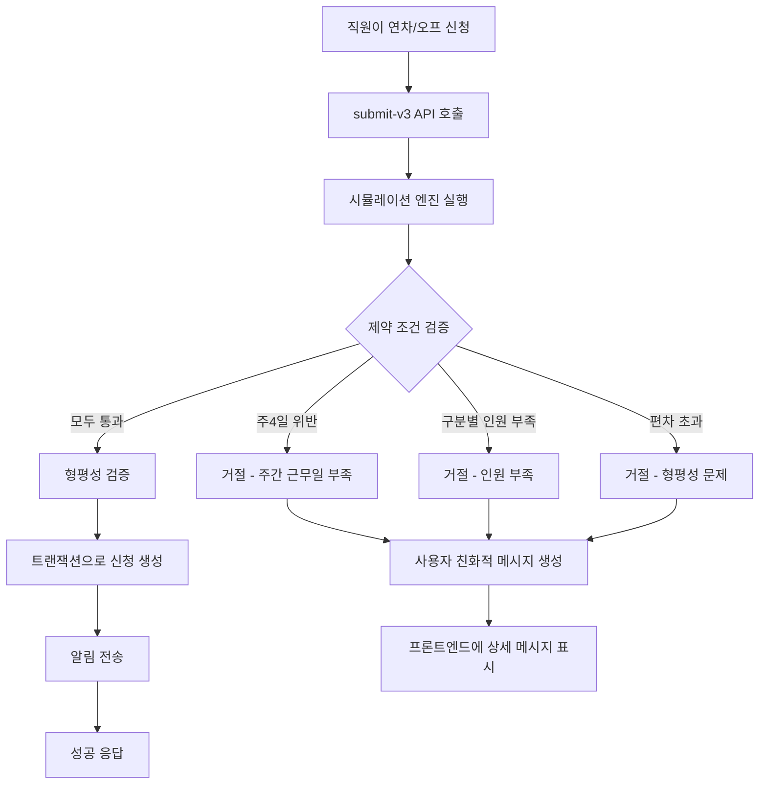

# 연차/오프 신청 동적 제한 시스템

## 📋 개요

배치 로직의 모든 제약 조건을 고려하여 신청 시점에 배치 불가능한 경우를 사전 차단하고, 직원이 이해할 수 있는 언어로 이유를 설명하는 시스템입니다.

## 🎯 핵심 원칙

### "자동 배치 우선" 철학

- **연차/오프 신청은 꼭 필요한 날짜만 신청**
- 나머지 OFF는 자동 배치 시스템이 형평성을 고려하여 자동 배분
- 과도한 신청은 자동 배치의 유연성을 떨어뜨려 전체 스케줄 생성 실패 가능

## 🏗️ 구현 단계

### Phase 0: 신청 페이지 안내 문구 추가 ✅ (완료)

**파일**: `src/app/(public)/leave-apply/[token]/page.tsx`

**구현 내용**:
- 자동 배치 시스템 설명 Alert 추가
- 신청 현황 통계 카드 표시 (현재 신청 / 예상 OFF / 자동 배치 예정)
- 권장 사항 가이드라인 (good/warning/critical 상태)

**주요 메시지**:
```
📌 연차/오프 신청 안내
✓ 꼭 필요한 날짜만 신청해주세요
✓ 나머지 OFF는 자동 배치 시스템이 형평성을 고려하여 자동 배분
✓ 과도한 신청은 전체 스케줄 생성을 방해할 수 있습니다
```

### Phase 1: 제약 조건 시뮬레이션 엔진 ✅ (완료)

**파일**: `src/lib/services/leave-eligibility-simulator.ts`

**주요 기능**:
```typescript
export async function simulateScheduleWithLeave(
  request: SimulationRequest
): Promise<SimulationResult>
```

**검증하는 제약 조건**:

#### 1. 주4일 제약 검증
- 해당 주(일~토)의 근무일 계산
- 공휴일 제외 처리
- 연차는 근무일로 계산
- 최소 근무일 = 4 - 공휴일 수

#### 2. 구분별 필수 인원 검증
- 해당 날짜의 DailySlot 조회
- 구분별 필요 인원 계산 (CategoryRatioSettings 기반)
- 신청자 제외 시 가용 인원 확인
- Flexible staff 고려

#### 3. 편차 허용 범위 검증 (선택적)
- 과거 누적 편차 조회
- ±3.0 상한선 체크
- 현재는 통과로 처리 (추후 확장 가능)

### Phase 2: 사용자 친화적 메시지 생성 ✅ (완료)

**파일**: `src/lib/services/leave-rejection-message-builder.ts`

**주요 함수**:
```typescript
export function buildRejectionMessage(
  result: SimulationResult
): RejectionMessage
```

**메시지 템플릿**:

| 이유 | 제목 | 메시지 예시 |
|------|------|------------|
| CATEGORY_SHORTAGE | 인원 부족으로 자동 배치가 어렵습니다 | 이 날짜는 실팀장급 4명이 필요하지만, 귀하를 제외하면 3명만 근무 가능합니다 |
| WEEK_4DAY_VIOLATION | 주간 근무일 부족 | 해당 주(2/11~2/17)에 이 날짜까지 OFF를 받으면 주4일 미만 근무가 됩니다 |
| FAIRNESS_EXCEEDED | 형평성 조율이 어렵습니다 | 과거 근무 이력을 고려할 때, 이 날짜 신청 시 형평성 조율이 어렵습니다 |
| NO_SCHEDULE | 스케줄이 아직 생성되지 않았습니다 | 해당 날짜의 근무 스케줄이 아직 생성되지 않았습니다 |

**공통 제안 메시지**:
- "꼭 필요한 날짜가 아니라면 자동 배치로 형평성 있는 OFF를 받으실 수 있습니다."
- "자동 배치 시스템이 모든 직원의 과거 근무 이력을 고려하여 가장 공평하게 OFF를 배정해드립니다."

### Phase 3: 신청 API 통합 ✅ (완료)

**파일**: `src/app/api/leave-apply/[token]/submit-v3/route.ts`

**주요 변경사항**:

1. **시뮬레이션 사전 검증 추가**
```typescript
// 3. 시뮬레이션: 자동 배치 가능성 사전 검증
const simulation = await simulateScheduleWithLeave({
  clinicId,
  staffId,
  leaveDate: applicationDate,
  leaveType: type,
  year,
  month,
})

if (!simulation.feasible) {
  const rejectionMessage = buildRejectionMessage(simulation)
  return NextResponse.json({
    success: false,
    error: rejectionMessage.message,
    title: rejectionMessage.title,
    suggestion: rejectionMessage.suggestion,
    userMessage: {
      title: rejectionMessage.title,
      message: rejectionMessage.message,
      suggestion: rejectionMessage.suggestion,
      icon: rejectionMessage.icon,
    }
  }, { status: 400 })
}
```

2. **성공 메시지 개선**
```typescript
message: '신청이 완료되었습니다. 나머지 OFF는 자동 배치 시스템이 형평성을 고려하여 배정합니다.'
```

### Phase 4: 프론트엔드 통합 ✅ (완료)

**파일**: `src/app/(public)/leave-apply/[token]/page.tsx`

**변경사항**:

1. **API 엔드포인트 변경**
```typescript
// 기존: /api/leave-apply/${params.token}/submit
// 변경: /api/leave-apply/${params.token}/submit-v3
```

2. **에러 메시지 표시 개선**
```typescript
const errorMsg = result.userMessage
  ? `${result.userMessage.title}\n${result.userMessage.message}\n💡 ${result.userMessage.suggestion}`
  : result.error || '실패'
```

## 📊 통계 API

**파일**: `src/app/api/leave-apply/[token]/statistics/route.ts`

**엔드포인트**: `GET /api/leave-apply/[token]/statistics?staffId=xxx`

**반환 정보**:
```typescript
interface Statistics {
  staffName: string
  categoryName: string
  totalBusinessDays: number         // 전체 영업일
  expectedOffDays: number           // 예상 총 OFF 수 (주4일 기준)
  currentApprovedCount: number      // 현재 승인된 연차/오프
  remainingAutoOff: number          // 자동 배치될 OFF
  applicationRatio: number          // 현재 신청 비율 (%)
  recommendedMaxApplications: number // 권장 최대 신청 수 (예상의 30%)
  guidelines: {
    status: 'good' | 'warning' | 'critical'
    message: string
  }
}
```

**가이드라인 기준**:
- **good**: 신청 수 ≤ 권장 최대 (예상의 30%)
- **warning**: 권장 최대 < 신청 수 ≤ 예상의 60%
- **critical**: 신청 수 > 예상의 60%

## 🧪 테스트

**테스트 스크립트**: `test-dynamic-restriction.js`

**실행 방법**:
```bash
# 테스트 데이터 수정 후 실행
node test-dynamic-restriction.js
```

**테스트 시나리오**:
1. 주4일 제약 위반 케이스
2. 구분별 인원 부족 케이스
3. 정상 신청 케이스

## 📁 파일 구조

```
src/
├── lib/
│   ├── services/
│   │   ├── leave-eligibility-simulator.ts      # 새 파일: 시뮬레이션 엔진
│   │   ├── leave-rejection-message-builder.ts  # 새 파일: 메시지 생성
│   │   └── ...
│   └── ...
├── app/
│   ├── api/
│   │   └── leave-apply/
│   │       └── [token]/
│   │           ├── statistics/                  # 기존: 통계 API
│   │           │   └── route.ts
│   │           ├── submit-v3/                   # 새 파일: 동적 제한 적용
│   │           │   └── route.ts
│   │           └── ...
│   └── (public)/
│       └── leave-apply/
│           └── [token]/
│               └── page.tsx                     # 수정됨: v3 API 사용
└── ...
```

## 🔄 작동 흐름



## 💡 주요 특징

### 1. 자동 배치 우선 원칙 강조

모든 메시지와 UI에서 "꼭 필요한 날짜만 신청"을 강조하고, 나머지는 자동 배치 시스템에 맡기도록 유도합니다.

### 2. 사용자 친화적 메시지

- 기술적 용어 최소화
- 구체적인 수치 제공 (부족 인원, 근무일 수 등)
- 대안 제시 (자동 배치 활용)

### 3. 실시간 통계 제공

신청 페이지에서 실시간으로 현재 신청 현황과 권장 사항을 표시하여 과도한 신청을 예방합니다.

### 4. 성능 최적화

- 시뮬레이션은 실제 배치를 실행하지 않고 제약 조건만 검증
- 목표 응답 시간: 3-5초 이내

## 🚀 향후 확장 가능성

### Phase 5 (선택적 구현)

1. **대안 날짜 추천**
   - 가능한 날짜 목록 제공
   - 형평성 점수 기반 추천

2. **편차 정보 상세 표시**
   - "평균보다 주말 1회 덜 근무" 등의 설명
   - 편차 점수 자체는 노출하지 않음

3. **과거 승인률 통계**
   - 날짜별 승인률 표시
   - 신청하기 좋은 날짜 추천

4. **관리자 대시보드**
   - 신청 현황 모니터링
   - 자동 배치 성공률 추적

## 📝 참고 사항

### 주의사항

1. **기존 API 유지**: `submit` API는 그대로 유지하고, `submit-v3`를 새로 생성
2. **하위 호환성**: 기존 시스템과의 호환성 유지
3. **점진적 롤아웃**: 테스트 후 단계적으로 적용

### 성능 고려사항

1. **데이터베이스 쿼리 최적화**
   - 필요한 데이터만 조회
   - 인덱스 활용

2. **캐싱 전략** (추후 구현)
   - 월별 스케줄 데이터 캐싱 (5분)
   - 구분별 비율 설정 캐싱

## ✅ 완료 체크리스트

- [x] Phase 0: 신청 페이지 안내 문구 추가
- [x] Phase 1: 제약 조건 시뮬레이션 엔진 구현
- [x] Phase 2: 사용자 친화적 메시지 빌더 구현
- [x] Phase 3: 신청 API (submit-v3) 생성
- [x] Phase 4: 프론트엔드 통합
- [x] TypeScript 컴파일 검증
- [x] 테스트 스크립트 작성
- [x] 문서화

## 🎉 완료!

동적 제한 시스템이 성공적으로 구현되었습니다. 이제 직원들은:

1. ✅ 자동 배치 우선 원칙을 명확히 이해
2. ✅ 신청 시점에 배치 가능 여부를 즉시 확인
3. ✅ 거절 시 이해하기 쉬운 이유와 대안을 제공받음
4. ✅ 실시간 통계로 적절한 신청 수준을 파악

이를 통해 전체 스케줄 생성의 안정성과 형평성이 크게 향상될 것입니다.
